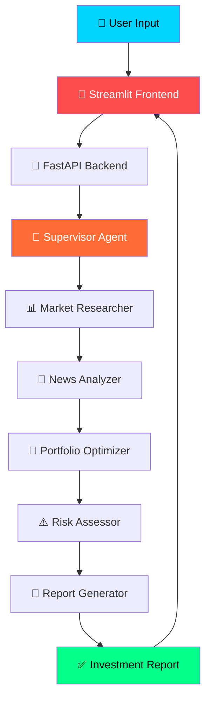

# 💰 FinAgent AI

<div align="center">


**[Live Demo](https://huggingface.co/spaces/PriyankaAhirwar15/finagent-ai) • [API Docs](http://localhost:8000/docs) • [Report Bug](https://github.com/PriyankaAhirwar15/FinAgent-AI_project/issues)**

</div>

---

## 🎯 What Is FinAgent AI?

FinAgent AI is a **production-grade multi-agent stock market analyzer**. It uses **6 specialized AI agents** working together in a LangGraph pipeline to deliver comprehensive investment analysis, portfolio optimization, and risk assessment — all powered by **live market data** and **Groq LLaMA 3.3-70B**.

---

## 🏗️ System Architecture


---

## 🤖 6-Agent Pipeline

| # | Agent | Role | Tool |
|---|---|---|---|
| 1 | 🎯 Supervisor | Orchestrates all agents | LangGraph |
| 2 | 📊 Market Researcher | Fetches live stock data | yFinance |
| 3 | 📰 News Analyzer | Analyzes news sentiment | Tavily API |
| 4 | 💼 Portfolio Optimizer | Suggests allocation strategy | Groq LLM |
| 5 | ⚠️ Risk Assessor | Calculates risk scores | Groq LLM |
| 6 | 📄 Report Generator | Creates investment report | Groq LLM |

---

---

## 🚀 How It Beats Traditional Analyzers

| Feature | Traditional App | FinAgent AI |
|---|---|---|
| Analysis Type | Single model | ✅ 6 specialized agents |
| Data Source | Static/delayed | ✅ Live real-time data |
| News Analysis | None | ✅ AI sentiment scoring |
| Portfolio | Manual | ✅ AI-optimized |
| Risk Assessment | Basic | ✅ Multi-factor AI |
| Report | None | ✅ Full downloadable report |
| Self-Correction | None | ✅ Automatic retry |
| Deployment | Local only | ✅ Cloud + Docker |

---

## 🛠️ Tech Stack
```
Frontend     │ Streamlit
Backend      │ FastAPI + Uvicorn
Agents       │ LangGraph + LangChain
LLM          │ Groq LLaMA 3.3-70B (FREE)
Stock Data   │ yFinance (FREE)
News Search  │ Tavily API (FREE)
Charts       │ Plotly
Container    │ Docker + Docker Compose
Deployment   │ HuggingFace Spaces
Version      │ Git + GitHub
```

---

## ⚡ Quick Start

### Prerequisites
- Python 3.10+
- [Groq API Key](https://console.groq.com/keys) (FREE)
- [Tavily API Key](https://app.tavily.com) (FREE)

### Installation
```bash
# Clone the repository
git clone https://github.com/PriyankaAhirwar15/FinAgent-AI_project.git
cd FinAgent-AI_project

# Create virtual environment
python -m venv venv
venv\Scripts\activate

# Install dependencies
pip install -r requirements.txt

# Set up environment variables
cp .env.example .env
# Add your API keys to .env
```

### Running The App
```bash
# Terminal 1 - FastAPI Backend
python -m uvicorn api.main:app --host 0.0.0.0 --port 8000 --reload

# Terminal 2 - Streamlit Frontend
streamlit run frontend/app.py
```

### Docker
```bash
docker-compose -f docker/docker-compose.yml up --build
```

---

## 📡 API Endpoints

| Method | Endpoint | Description |
|---|---|---|
| GET | `/` | Root endpoint |
| GET | `/health` | Health check |
| POST | `/analyze` | Analyze stocks |
| GET | `/docs` | Swagger documentation |

### Example Request
```python
import requests

response = requests.post(
    "http://localhost:8000/analyze",
    json={
        "query": "Best stocks for long term investment",
        "stocks": ["AAPL", "TSLA", "GOOGL"]
    }
)
print(response.json())
```

---

## 📁 Project Structure
```
FinAgent-AI/
│
├── agents/
│   ├── supervisor.py
│   ├── market_researcher.py
│   ├── news_analyzer.py
│   ├── portfolio_optimizer.py
│   ├── risk_assessor.py
│   └── report_generator.py
│
├── core/
│   ├── state.py
│   ├── graph.py
│   └── checkpointer.py
│
├── tools/
│   ├── stock_tool.py
│   ├── news_tool.py
│   └── chart_tool.py
│
├── api/
│   └── main.py
│
├── frontend/
│   └── app.py
│
├── docker/
│   ├── Dockerfile
│   └── docker-compose.yml
│
├── config.py
├── requirements.txt
├── .env.example
└── README.md
```

---

## 📊 Sample Results
```
✅ Stocks Analyzed: AAPL, TSLA, GOOGL
📈 Overall Risk: LOW
💼 Portfolio Strategy: Growth-focused allocation

AAPL  → 45% allocation │ Risk: LOW  │ Sentiment: POSITIVE
TSLA  → 25% allocation │ Risk: HIGH │ Sentiment: NEUTRAL  
GOOGL → 30% allocation │ Risk: LOW  │ Sentiment: POSITIVE
```

---

## 📜 License

MIT License — Copyright © 2026 Priyanka Ashok Ahirwar

---

<div align="center">

### ⭐ Star this repo if you found it helpful!


**Built with ❤️ by Priyanka Ashok Ahirwar**

*This project is for educational purposes only. Not financial advice.*

</div>
```

---

**→ Step 3: After pasting — scroll down and click**
```
[ Commit changes ]
