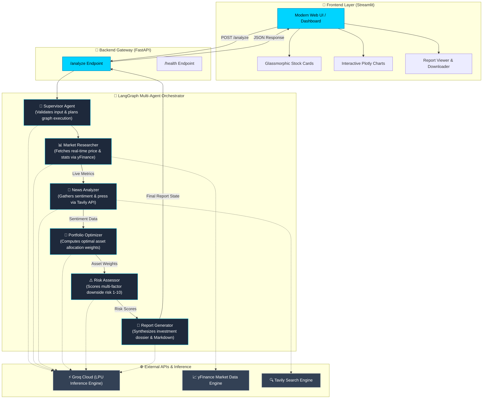

# 💰 FinAgent AI — Autonomous Multi-Agent Stock Market Intelligence

<div align="center">


<p align="center">
  <a href="https://huggingface.co/spaces/PRIYANKAAhirwar/FinAgent-AI"></a>
  <a href="https://github.com/PriyankaAhirwar15/FinAgent-AI_project"></a>
  <a href="#-api-reference"></a>
</p>

[](https://www.python.org/)
[](https://github.com/langchain-ai/langgraph)
[](https://groq.com/)
[](https://streamlit.io/)
[](https://fastapi.tiangolo.com/)
[](https://www.docker.com/)
[](LICENSE)

---

### 🌐 [Explore the Live Web Application](https://huggingface.co/spaces/PRIYANKAAhirwar/FinAgent-AI)

</div>

## 📌 Table of Contents
- [✨ Key Features](#-key-features)
- [🏛️ System Architecture](#️-system-architecture)
- [🤖 Multi-Agent Pipeline](#-multi-agent-pipeline)
- [🖥️ UI / UX Showcase](#️-ui--ux-showcase)
- [⚡ Quick Start & Setup](#-quick-start--setup)
- [⚙️ Configuration & Environment Variables](#️-configuration--environment-variables)
- [🔧 Resolving the Groq Model 404 Issue](#-resolving-the-groq-model-404-issue)
- [📡 API Reference](#-api-reference)
- [🐳 Docker & Cloud Deployment](#-docker--cloud-deployment)
- [📂 Project Structure](#-project-structure)
- [📄 License & Disclaimer](#-license--disclaimer)

---

## ✨ Key Features

- 🧠 **Autonomous 6-Agent State Graph**: Orchestrated with **LangGraph** for cyclic coordination, self-correction, and modular data transformations.
- ⚡ **Ultra-Fast LLM Inference**: Powered by **Groq Cloud** with multi-model fallback cascade (`openai/gpt-oss-120b`, `openai/gpt-oss-20b`, `qwen/qwen3.6-27b`).
- 📈 **Real-Time Market Feeds**: Live financial metrics, 1-month trends, 52-week ranges, P/E ratios, and market cap via **yFinance**.
- 📰 **Intelligent News & Sentiment Analysis**: Web search and financial sentiment extraction using **Tavily AI Search**.
- 💼 **Portfolio Optimization Engine**: Dynamically calculates weight percentages, diversification strategies, and capital allocation.
- ⚠️ **Multi-Factor Risk Assessment**: Quantifies risk scores (1-10 scale), risk categories (*Low, Medium, High*), and drawdown vulnerability.
- 📄 **Executive Investment Reports**: Generates downloadable markdown analysis summaries with one-click export.
- 🎨 **Modern Dark-Mode UI**: Sleek, responsive, interactive Streamlit frontend with glassmorphic cards and Plotly financial visualizers.

---

## 🏛️ System Architecture


```mermaid
flowchart TD
    subgraph Client["🎨 Frontend Layer (Streamlit)"]
        UI["Modern Web UI / Dashboard"]
        Cards["Glassmorphic Stock Cards"]
        Plots["Interactive Plotly Charts"]
        ReportView["Report Viewer & Downloader"]
    end

    subgraph API["🚀 Backend Gateway (FastAPI)"]
        Router["/analyze Endpoint"]
        Health["/health Endpoint"]
    end

    subgraph LangGraphEngine["🤖 LangGraph Multi-Agent Orchestrator"]
        Sup["🎯 Supervisor Agent\n(Validates input & plans graph execution)"]
        MR["📊 Market Researcher\n(Fetches real-time price & stats via yFinance)"]
        NA["📰 News Analyzer\n(Gathers sentiment & press via Tavily API)"]
        PO["💼 Portfolio Optimizer\n(Computes optimal asset allocation weights)"]
        RA["⚠️ Risk Assessor\n(Scores multi-factor downside risk 1-10)"]
        RG["📄 Report Generator\n(Synthesizes investment dossier & Markdown)"]
    end

    subgraph External["🌐 External APIs & Inference"]
        GroqAPI["⚡ Groq Cloud (LPU Inference Engine)"]
        YF["📈 yFinance Market Data Engine"]
        Tavily["🔍 Tavily Search Engine"]
    end

    UI -->|POST /analyze| Router
    Router --> Sup
    Sup --> MR
    MR -->|Live Metrics| NA
    NA -->|Sentiment Data| PO
    PO -->|Asset Weights| RA
    RA -->|Risk Scores| RG
    RG -->|Final Report State| Router
    Router -->|JSON Response| UI
    
    MR -.-> YF
    NA -.-> Tavily
    Sup & MR & NA & PO & RA & RG -.-> GroqAPI
    UI --> Cards & Plots & ReportView

    classDef accent fill:#00D4FF,stroke:#0099CC,stroke-width:2px,color:#000;
    classDef agent fill:#1E293B,stroke:#00D4FF,stroke-width:1px,color:#fff;
    classDef external fill:#334155,stroke:#64748B,stroke-width:1px,color:#fff;
    class UI,Router accent;
    class Sup,MR,NA,PO,RA,RG agent;
    class GroqAPI,YF,Tavily external;
```

---

## 🤖 Multi-Agent Pipeline

| # | Agent | Primary Role | Data Source / Engine | Output Artifact |
|---|-------|--------------|----------------------|-----------------|
| **1** | **🎯 Supervisor** | Validates user query, checks ticker validity, initializes graph | LangGraph State | Directed execution plan |
| **2** | **📊 Market Researcher** | Fetches live market quotes, percent change, P/E ratios, sector | `yFinance` API | Comprehensive stock dictionary |
| **3** | **📰 News Analyzer** | Performs targeted financial search & extracts market sentiment | `Tavily Search` + Groq | Sentiment scores & news summaries |
| **4** | **💼 Portfolio Optimizer** | Formulates strategic asset allocation totaling 100% | Groq LPU | Weighted portfolio distribution |
| **5** | **⚠️ Risk Assessor** | Evaluates downside risk, volatility, and single-stock exposures | Groq LPU | Risk index (1–10) & classification |
| **6** | **📄 Report Generator** | Synthesizes all agent outputs into an executive markdown dossier | Groq LPU + File I/O | Exportable Investment Report (`.md`) |

---

## 🖥️ UI / UX Showcase

<div align="center">

```
 ┌─────────────────────────────────────────────────────────────────────────────┐
 │ 💰 FinAgent AI  •  6-Agent Autonomous Stock Intelligence                    │
 ├─────────────────────────────────────────────────────────────────────────────┤
 │ [ AAPL, MSFT, NVDA, GOOGL ]                                [ 🚀 Analyze ]  │
 ├─────────────────────────────────────────────────────────────────────────────┤
 │                                                                             │
 │  ┌──────────────┐  ┌──────────────┐  ┌──────────────┐  ┌──────────────┐    │
 │  │ AAPL         │  │ MSFT         │  │ NVDA         │  │ GOOGL        │    │
 │  │ Apple Inc.   │  │ Microsoft    │  │ NVIDIA Corp  │  │ Alphabet     │    │
 │  │ $235.40      │  │ $448.20      │  │ $128.90      │  │ $179.80      │    │
 │  │ ▲ +1.8%      │  │ ▲ +0.9%      │  │ ▲ +3.4%      │  │ ▼ -0.4%      │    │
 │  │ Tech/Hardware│  │ Software     │  │ Semi/AI      │  │ Internet     │    │
 │  └──────────────┘  └──────────────┘  └──────────────┘  └──────────────┘    │
 │                                                                             │
 │  ┌───────────────────────────────┐     ┌────────────────────────────────┐  │
 │  │ 🎯 AI Portfolio Allocation    │     │ ⚠️ Risk Assessment             │  │
 │  │       [ Donut Chart ]         │     │ AAPL:  [██████░░░░] Low (3/10) │  │
 │  │  • AAPL: 35%   • NVDA: 25%    │     │ NVDA:  [████████░░] Med (6/10) │  │
 │  │  • MSFT: 25%   • GOOGL: 15%   │     │ Overall: MODERATE GROWTH       │  │
 │  └───────────────────────────────┘     └────────────────────────────────┘  │
 └─────────────────────────────────────────────────────────────────────────────┘
```

</div>

- **Dynamic Interactive Charts**: Plotly-powered donut graphs for portfolio distribution.
- **Visual Risk Meters**: Color-coded progress bars with real-time level evaluation.
- **Glassmorphic Metric Cards**: Real-time pricing, percentage indicators, and company meta.
- **One-Click Export**: Downloadable full investment dossier in markdown.

---

## ⚡ Quick Start & Setup

### 1. Clone the Repository
```bash
git clone https://github.com/PriyankaAhirwar15/FinAgent-AI_project.git
cd FinAgent-AI_project
```

### 2. Set Up Virtual Environment
```bash
# Windows
python -m venv venv
.\venv\Scripts\activate

# macOS / Linux
python3 -m venv venv
source venv/bin/activate
```

### 3. Install Dependencies
```bash
pip install --upgrade pip
pip install -r requirements.txt
```

### 4. Configure Environment Variables
Create a `.env` file in the project root (or copy from `.env.example`):
```bash
cp .env.example .env
```
Add your free API keys to `.env`:
```ini
GROQ_API_KEY=gsk_your_groq_api_key_here
TAVILY_API_KEY=tvly_your_tavily_api_key_here
MODEL_NAME=openai/gpt-oss-120b
API_HOST=0.0.0.0
API_PORT=8000
```

> 🔑 **Get Free API Keys:**
> - [Groq Cloud Console](https://console.groq.com/keys) (Ultra-fast LLM inference)
> - [Tavily AI Search](https://app.tavily.com/) (Web search engine for AI agents)

### 5. Launch the Application

#### Option A — Start Both Services Separately:
```bash
# Terminal 1: Launch FastAPI Backend
uvicorn api.main:app --host 0.0.0.0 --port 8000 --reload

# Terminal 2: Launch Streamlit Dashboard
streamlit run frontend/app.py
```

#### Option B — Run with Docker Compose:
```bash
docker-compose -f docker/docker-compose.yml up --build
```

Access the web interface at **`http://localhost:8501`** and Swagger API documentation at **`http://localhost:8000/docs`**.

---

## ⚙️ Configuration & Environment Variables

| Variable | Type | Default | Description |
|---|---|---|---|
| `GROQ_API_KEY` | *string* | `""` | **Required**. API key from [Groq Console](https://console.groq.com/keys). |
| `MODEL_NAME` | *string* | `"openai/gpt-oss-120b"` | Groq Model ID (e.g. `openai/gpt-oss-120b`, `openai/gpt-oss-20b`, `qwen/qwen3.6-27b`). |
| `TAVILY_API_KEY` | *string* | `""` | **Required**. API key from [Tavily](https://app.tavily.com). |
| `API_HOST` | *string* | `"0.0.0.0"` | Host address for FastAPI backend. |
| `API_PORT` | *integer* | `8000` | Port for FastAPI backend. |
| `API_URL` | *string* | `"https://finagent-api-upgrade.onrender.com"` | Backend gateway URL used by the Streamlit frontend. |

---

## 🔧 Resolving the Groq Model 404 Issue

### 🔍 Root Cause
If you encounter the following error:
```json
API Error: {"detail":"'Error code: 404 - {\'error\': {\'message\': \'The model llama-3.3-70b-versatile does not exist or you do not have access to it.\', \'type\': \'invalid_request_error\', \'code\': \'model_not_found\'}}'"}
```
**Reason**: Groq periodically upgrades and decommissions model endpoints. Older model identifiers like `llama-3.3-70b-versatile` or `llama-3.1-70b-versatile` were retired for developer tiers.

### ✅ Solution Implemented
1. **Dynamic Model Configuration**: FinAgent AI now uses the latest production models (`openai/gpt-oss-120b`, `openai/gpt-oss-20b`, `qwen/qwen3.6-27b`).
2. **Automatic Fallback Cascade**: If the primary model encounters a 404 or decommission status, `safe_llm_invoke` automatically transitions to alternative models without failing the user's request.
3. **Configurable via `.env`**: Set `MODEL_NAME=openai/gpt-oss-120b` or any active model ID in your environment variables.

---

## 📡 API Reference

### `POST /analyze`
Runs the complete 6-agent LangGraph workflow on specified stocks.

#### Request Body:
```json
{
  "query": "Which stock is best for long-term growth?",
  "stocks": ["AAPL", "NVDA", "MSFT"]
}
```

#### Response:
```json
{
  "success": true,
  "report": "# FinAgent AI - Investment Analysis Report...",
  "market_data": {
    "AAPL": {
      "company_name": "Apple Inc.",
      "current_price": 235.4,
      "change_percent": 1.82,
      "sector": "Technology"
    }
  },
  "portfolio_allocation": {
    "allocations": {
      "AAPL": 40.0,
      "NVDA": 35.0,
      "MSFT": 25.0
    },
    "strategy": "Aggressive Tech Growth Strategy"
  },
  "risk_assessment": {
    "overall_risk": "medium",
    "risk_scores": {
      "AAPL": {"score": 3, "level": "low", "factors": "Strong cash flow & balance sheet"},
      "NVDA": {"score": 6, "level": "medium", "factors": "High valuation multiple"}
    }
  },
  "messages": [
    "Supervisor: Analysis started for ['AAPL', 'NVDA', 'MSFT']",
    "MarketResearcher: Fetched data for ['AAPL', 'NVDA', 'MSFT']",
    "NewsAnalyzer: Analyzed sentiment for ['AAPL', 'NVDA', 'MSFT']",
    "PortfolioOptimizer: Optimized allocation for ['AAPL', 'NVDA', 'MSFT']",
    "RiskAssessor: Assessed risk for ['AAPL', 'NVDA', 'MSFT']",
    "ReportGenerator: Report generated successfully!"
  ]
}
```

### `GET /health`
Returns the status of the backend server.
```json
{
  "status": "healthy"
}
```

---

## 🐳 Docker & Cloud Deployment

### Build & Run via Docker
```bash
docker build -t finagent-ai -f docker/Dockerfile .
docker run -p 8000:8000 -p 8501:8501 --env-file .env finagent-ai
```

### Deployment Topology
- **Frontend Dashboard**: Hosted on [Hugging Face Spaces](https://huggingface.co/spaces/PRIYANKAAhirwar/FinAgent-AI) (Streamlit).
- **Backend API Server**: Hosted on [Render](https://render.com) (FastAPI + Uvicorn).

---

## 📂 Project Structure

```
FinAgent-AI_project/
│
├── agents/                      # 🤖 6 Specialized AI Agents
│   ├── supervisor.py            # Graph orchestrator & planner
│   ├── market_researcher.py     # Live market quote fetcher
│   ├── news_analyzer.py         # Tavily news sentiment engine
│   ├── portfolio_optimizer.py   # Portfolio allocation model
│   ├── risk_assessor.py         # Multi-factor risk scorer
│   └── report_generator.py      # Investment report compiler
│
├── core/                        # 🧠 LangGraph State & Graph Definition
│   ├── state.py                 # TypedDict AgentState schema
│   ├── graph.py                 # StateGraph compiled pipeline
│   └── checkpointer.py          # MemorySaver state persistence
│
├── tools/                       # 🛠️ Data Extraction & Visualization Tools
│   ├── stock_tool.py            # yFinance market integration
│   ├── news_tool.py             # Tavily search integration
│   └── chart_tool.py            # Plotly interactive chart builders
│
├── api/                         # 🚀 FastAPI Backend Gateway
│   ├── main.py                  # Endpoints & CORS configuration
│   └── routes/                  # Modular route handlers
│
├── frontend/                    # 🎨 Streamlit Web Application
│   └── app.py                   # Responsive dark-theme dashboard
│
├── docker/                      # 🐳 Containerization
│   ├── Dockerfile               # Multi-port container image
│   └── docker-compose.yml       # Production orchestration
│
├── reports/generated/           # 📄 Exported Markdown Reports
├── config.py                    # ⚙️ Centralized Settings & Safe LLM Handler
├── requirements.txt             # 📦 Project Dependencies
├── .env.example                 # 📋 Template for Environment Keys
└── README.md                    # 📖 Project Documentation
```

---

## 📄 License & Disclaimer

Distributed under the **MIT License**. See `LICENSE` for more information.

> ⚠️ **Financial Disclaimer**: *FinAgent AI is an AI-powered software demonstration built for informational and educational purposes only. None of the generated reports, allocations, or analyses constitute financial, investment, or legal advice. Always conduct your own research before making financial decisions.*

<div align="center">

**Built with ❤️ by [Priyanka Ashok Ahirwar](https://github.com/PriyankaAhirwar15)**

⭐ **Star this repository if you found it useful!**

</div>
